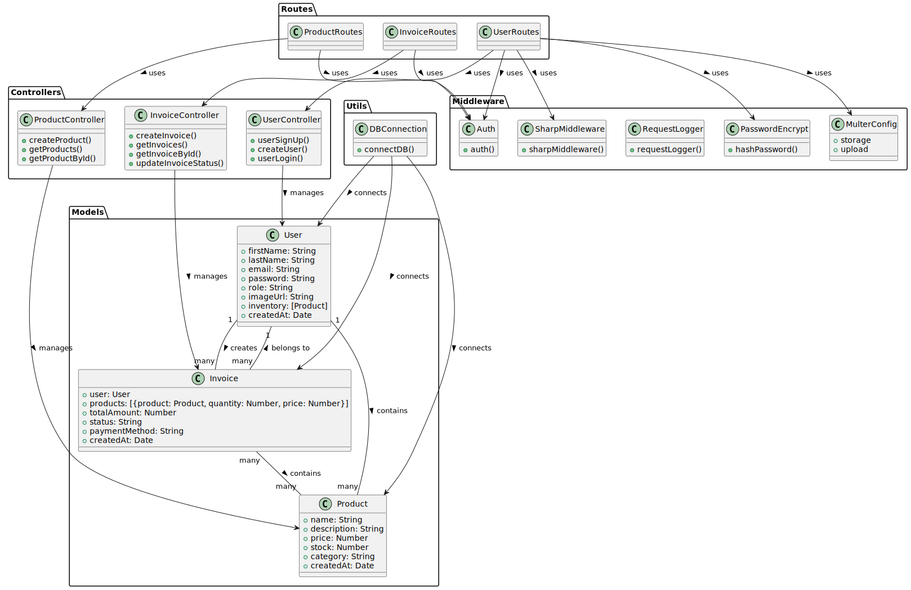

# E-Commerce Backend API

This is a RESTful API for an e-commerce platform built with Node.js, Express, and MongoDB. The API provides endpoints for user authentication, product management, invoice generation, and image upload functionality.

## 🌍 Live API

The backend API is hosted on Render. You can access it here:

**[API Base URL](https://epita-server-sided-javascript.onrender.com)**

## Project UML Diagram


## Models UML


## Features

- **User Authentication**: JWT-based authentication system
- **User Management**: Create, update, and retrieve user information
- **Product Management**: Add, list, and view product details
- **Invoice System**: Create and manage purchase invoices
- **Image Upload**: Upload and process profile pictures with Sharp
- **Role-Based Access**: Admin and user roles with different permissions

## Technology Stack

- **Backend**: Node.js, Express.js
- **Database**: MongoDB with Mongoose ORM
- **Authentication**: JWT (JSON Web Tokens)
- **Image Processing**: Sharp, Multer
- **Security**: bcryptjs for password hashing

## Getting Started

### Prerequisites

- Node.js (v14 or higher)
- MongoDB (local instance or MongoDB Atlas)
- npm or yarn

### Installation

1. Clone the repository:

   ```bash
   git clone https://github.com/yourusername/ecommerce-backend.git
   cd ecommerce-backend
   ```

2. Install dependencies:

   ```bash
   cd src
   npm install --legacy-peer-deps
   ```

3. Create a `.env` file in the src directory with the following environment variables:

   ```
   MONGODB_URI=your_mongodb_connection_string
   JWT_SECRET=your_jwt_secret_key
   PORT=3000
   ```

4. Start the development server:
   ```bash
   npm run dev
   ```

## API Endpoints

### Authentication

- `POST /api/users/signup`: Register a new user
- `POST /api/users/login`: Login and receive a JWT token

### Users

- `GET /api/users`: Get all users (protected)
- `GET /api/users/me`: Get current user profile (protected)
- `PUT /api/users/userUpdate`: Update user profile with image (protected)

### Products

- `GET /api/products`: Get all products (protected)
- `GET /api/products/:id`: Get a specific product (protected)
- `POST /api/products`: Create a new product (protected)

### Invoices

- `GET /api/invoices`: Get all invoices (protected)
- `GET /api/invoices/:id`: Get a specific invoice (protected)
- `POST /api/invoices`: Create a new invoice (protected)
- `PATCH /api/invoices/:id/status`: Update invoice status (protected)

## Image Upload

The API supports user profile picture uploads:

- Images are processed using Sharp for optimization
- Uploaded files are stored in the `uploads` directory
- Formats supported: JPG, PNG, WebP, GIF

## Testing with Postman

1. **Register a User**:

   - Method: POST
   - URL: `http://localhost:3000/api/users/signup`
   - Body: Raw JSON
     ```json
     {
       "firstName": "John",
       "lastName": "Doe",
       "email": "john@example.com",
       "password": "password123",
       "role": "user"
     }
     ```

2. **Login**:

   - Method: POST
   - URL: `http://localhost:3000/api/users/login`
   - Body: Raw JSON
     ```json
     {
       "email": "john@example.com",
       "password": "password123"
     }
     ```
   - Response will include a JWT token for authentication

3. **Upload Profile Picture**:

   - Method: PUT
   - URL: `http://localhost:3000/api/users/userUpdate`
   - Headers: `Authorization: Bearer your_token_here`
   - Body: form-data
     - Key: `image` (Type: File)
     - Value: Select an image file

4. **Create a Product**:

   - Method: POST
   - URL: `http://localhost:3000/api/products`
   - Headers: `Authorization: Bearer your_token_here`
   - Body: Raw JSON
     ```json
     {
       "name": "Smartphone",
       "description": "Latest model smartphone",
       "price": 799.99,
       "stock": 15,
       "category": "Electronics"
     }
     ```

5. **Create an Invoice**:
   - Method: POST
   - URL: `http://localhost:3000/api/invoices`
   - Headers: `Authorization: Bearer your_token_here`
   - Body: Raw JSON
     ```json
     {
       "userId": "user_id_here",
       "products": [
         {
           "productId": "product_id_here",
           "quantity": 2
         }
       ],
       "paymentMethod": "credit_card"
     }
     ```

## Security Measures

- Password hashing using bcryptjs
- JWT authentication for protected routes
- CORS enabled for API security

## Deployment

The API can be deployed to platforms like Render, Heroku, or any other Node.js hosting service.

Make sure to set the appropriate environment variables in your deployment platform.

## License

[MIT](LICENSE)

## Contributors

- [Debojyoti Mishra](https://github.com/DebojyotiMishra)
